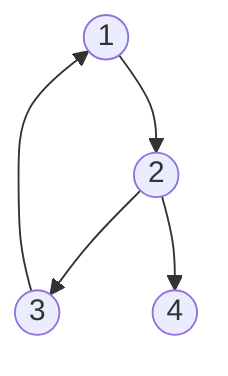

# Union Find Disjoint Set

## KaTeX
You can render LaTeX mathematical expressions using [KaTeX](https://khan.github.io/KaTeX/):


The *Gamma function* satisfying $\Gamma(n) = (n-1)!\quad\forall n\in\mathbb N$ is via the Euler integral

$$
\Gamma(z) = \int_0^\infty t^{z-1}e^{-t}dt\,.
$$


> You can find more information about **LaTeX** mathematical expressions [here](http://meta.math.stackexchange.com/questions/5020/mathjax-basic-tutorial-and-quick-reference).


## UML diagrams

You can render UML diagrams using [Mermaid](https://mermaidjs.github.io/). For example, this will produce a sequence diagram:





$$
log*n = \begin{cases}
	0 &\text{if } n <= 1 \\
	1 + log*(log(n)) &\text{if } n > 1 
\end{cases}
$$

O(log*n) is almost O(1) level ( not as fast as O(1) ), but much faster than O(log n).

```cpp

struct UFDS {
	vector<int> f, siz;
	UFDS(int n) : f(n), siz(n, 1) { iota(f.begin(), f.end(), 0); }
	int leader(int x) {
		while(x != f[x]) x = f[x] = f[f[x]];
		return x;
	}
	bool same(int x, int y) { return leader(x) == leader(y); }
	bool merge(int x, int y) {
		x = leader(x);
		y = leader(y);
		if (x == y)
			return false;
		siz[x] += siz[y];
		f[y] = x;
		return true;
	}
	int size(int x) { return siz[leader(x)]; }
};

```
